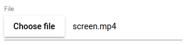
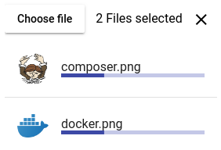

[](https://www.npmjs.com/package/@webacad/ng-mat-file-upload)
[](https://travis-ci.org/Web-ACAD/ng-mat-file-upload)

# WebACAD/MatFileUpload

File input for angular material



## Dependencies

* `@angular/animations`
* `@angular/cdk`
* `@angular/common`
* `@angular/core`
* `@angular/forms`
* `@angular/material`
* `@angular/platform-browser`
* `@webacad/observable-file-reader`
* `rxjs`

## Installation

```bash
$ npm install --save @webacad/ng-mat-file-upload
```

or with yarn

```bash
$ yarna add @webacad/ng-mat-file-upload
```

## Register module

**app.module.ts**

```typescript
import {MatFileUploadModule} from '@webacad/ng-mat-file-upload';

@NgModule({
    imports: [
        MatFileUploadModule,
    ],
})
export class AppModule {}
```

## Usage

```html
<wa-mat-file-upload>Choose file</wa-mat-file-upload>
```

**Available options:**

* `multiple` (boolean): allow to select multiple files
* `dense` (boolean): show with smaller text sizes
* `preview` (boolean): display selected files in preview box
* `previewPosition` (top/bottom): position of preview box, default is `bottom`
* `color` (string): change color of `mat-raised-button`
* `selectedText` (function): custom selected text translation function

## Using in angular forms

This package implements all the necessary code for angular forms. That means that you can use it just like any other 
ordinary form control.

It is also fully ready for material's `<mat-form-field>` component.

## Upload progress



**Example:**

```html
<wa-mat-file-upload
    #fileUpload="waMatFileUpload"
    placeholder="File"
    [preview]="true"
    (change)="onFileChange(fileUpload)"
>Choose file</wa-mat-file-upload>
```

```typescript
import {MatFileUploadComponent} from '@webacad/ng-mat-file-upload';

export class UploadComponent
{
    
    public onFileChange(fileUpload: MatFileUploadComponent): void
    {
        const files = fileUpload.files;
        
        if (!files.length) {
            return;
        }
        
        const stepSize: number = 10;
        
        this.uploadFile(files[0].file, () => {
            files[0].increaseProgress(stepSize);
        }, () => {
            files[0].progress = 100;
            fileUpload.disabled = true;
        });
    }
    
    private uploadFile(file: File, onChunk: () => void, onDone: () => void): void
    {
        // todo
    }
    
}
```

## Validation

There are some build in form validators which you can use out of the box.

* `fileMaxSize(number)`: Maximum size of file(s)
* `fileType(string[])`: List of allowed mime types

## Internationalization

There is only one text in this component which should be translated for better international support. It is the selected 
preview text next to dialog button.

**Default form:**

* no file selected: empty string
* 1 file selected: name of selected file
* more than 1 file selected: `files.length + " Files selected"`

Custom value can be provided via `selectedText` input. 

First create translating method:

```typescript
import {UploadFile} from '@webacad/ng-mat-file-upload';

class MyComponent
{
    
    public translateValue(files: Array<UploadFile>): string
    {
        if (!files.length) {
            return '';
        }
        
        if (files.length === 1) {
            return '1 file';
        }
        
        return `${files.length} files`;
    }
    
}
```

Now pass your `translateValue` method into the `selectedText` input:

```html
<wa-mat-file-upload
    placeholder="File"
    [selectedText]="translateValue"
>Choose file</wa-mat-file-upload>
```
