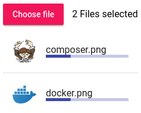

[](https://www.npmjs.com/package/@webacad/ng-mat-file-upload)
[](https://travis-ci.org/Web-ACAD/ng-mat-file-upload)

# WebACAD/MatFileUpload

File input for angular material


## Installation

```bash
$ npm install --save @angular/common@^5.0
$ npm install --save @angular/core@^5.0
$ npm install --save @angular/forms@^5.0
$ npm install --save @angular/material@^5.0
$ npm install --save rxjs
$ npm install --save @webacad/ng-mat-file-upload
```

or with yarn

```bash
$ yarna add @angular/common@^5.0
$ yarna add @angular/core@^5.0
$ yarna add @angular/forms@^5.0
$ yarna add @angular/material@^5.0
$ yarna add rxjs
$ yarna add @webacad/ng-mat-file-upload
```

## Register module

**app.module.ts**

```typescript
import {MatFileUploadModule} from '@webacad/ng-mat-file-upload';

@NgModule({
    imports: [
        MatFileUploadModule,
    ],
})
export class AppModule {}
```

## Usage

```html
<wa-mat-file-upload>Choose file</wa-mat-file-upload>
```

**Available options:**

* `multiple` (boolean): allow to select multiple files
* `color` (string): change color of `mat-raised-button`

## Using in angular forms

This package implements all the necessary code for angular forms. That means that you can use it just like any other 
ordinary form control.

It is also fully ready for material's `<mat-form-field>` component.

## Preview mode



Preview mode is mainly useful for uploading large files or showing selected images.

**Example:**

```html
<wa-mat-file-upload
    #fileUpload="waMatFileUpload"
    placeholder="File"
    [multiple]="true"
    (change)="onFileChange(fileUpload)"
>Choose file</wa-mat-file-upload>
```

```typescript
import {MatFileUploadComponent} from '@webacad/ng-mat-file-upload';

export class UploadComponent
{
    
    public onFileChange(fileUpload: MatFileUploadComponent): void
    {
        const files = fileUpload.files;
        
        if (!files.length) {
            fileUpload.preview = false;
            return;
        }
        
        fileUpload.preview = true;
        
        const stepSize: number = 10;
        
        this.uploadFile(files[0].file, () => {
            files[0].increaseProgress(stepSize);
        }, () => {
            files[0].progress = 100;
            fileUpload.disabled = true;
            fileUpload.preview = false;
        });
    }
    
    private uploadFile(file: File, onChunk: () => void, onDone: () => void): void
    {
        // todo
    }
    
}
```
